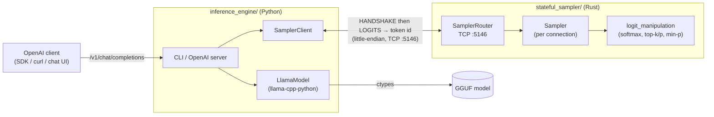
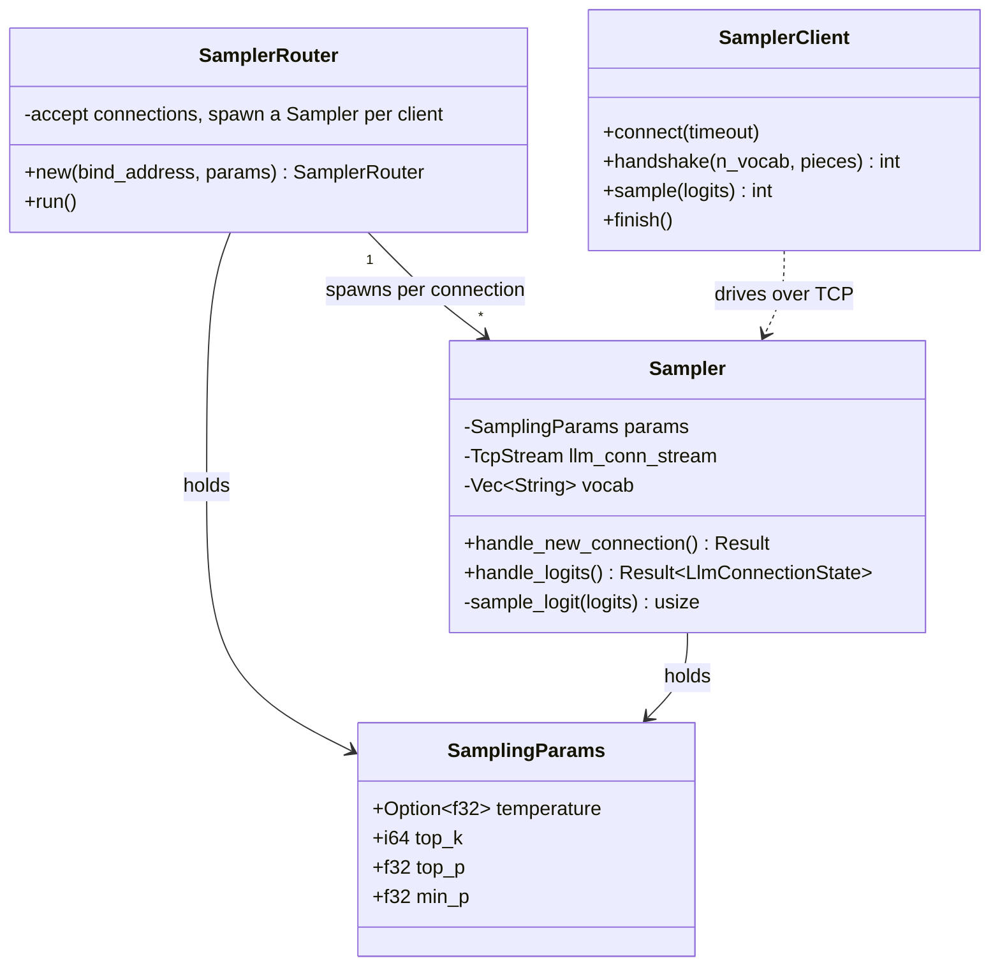
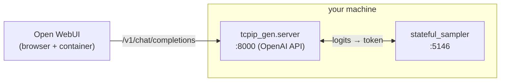

# stateful-logit-sampler

This is the open source version of what we've built at printers. 
This is a tool to inspect the model's bag of next-token prediction per next-token.
This is useful for diagnosing, fine-tuning, harness engineering, understanding what is the probability distribution of your desired output. 

A two-part system that splits LLM **inference** from token **sampling** across a
TCP socket. The inference engine runs llama.cpp locally and produces logits each
decode step; a separate, stateful sampler process turns those logits into the
next token. Keeping sampling in its own process lets the sampling policy evolve
(and carry state across steps) independently of the model runtime.

This repository is a monorepo of two cooperating components:

| Directory | Language | Role | Docs |
|-----------|----------|------|------|
| [`inference_engine/`](inference_engine/) | Python | Loads a GGUF model with `llama-cpp-python`, runs the decode loop, streams raw logits to the sampler, and prints the chosen tokens. Also ships an OpenAI-compatible HTTP server. | [README](inference_engine/README.md) |
| [`stateful_sampler/`](stateful_sampler/) | Rust | TCP server that receives logits and returns a sampled token id (temperature / top-k / top-p / min-p). Listens on `:5146`. | [README](stateful_sampler/README.md) |

The two talk over a small little-endian wire protocol: a one-time **handshake**
(vocabulary exchange) followed by a **per-token** loop (`LOGITS` → token id).

## Architecture



## Component responsibilities



> The Rust sampler assumes **one** engine and **one** active chat completion at a
> time — there is no per-request context id, so concurrent chats / branched
> generations are not supported. See [`stateful_sampler/README.md`](stateful_sampler/README.md).

## Wire protocol

All integers and floats are **little-endian**.

| Phase     | Engine → Sampler                                                       | Sampler → Engine                       |
|-----------|------------------------------------------------------------------------|----------------------------------------|
| Handshake | `"HANDSHAKE"` + `i32(n_vocab)` + `(piece + \x00) × n_vocab` + `\x00`    | `i32(n_vocab)` (4 bytes)               |
| Per token | `"LOGITS"` + `n_vocab × f32`                                            | `i32(count)` + `i32(token)` (8 bytes)  |
| End       | socket close on end-of-generation                                      | (read == 0 ⇒ "Completed")              |

## Quick start (Docker Compose)

One command brings up the sampler, the OpenAI-compatible engine, and Open WebUI:

```bash
mkdir -p models                      # put a .gguf model file here
MODEL_FILE=<your-model>.gguf docker compose up --build
```

| Service | Port | What it is |
|---------|------|------------|
| `sampler` | 5146 | Rust stateful sampler |
| `engine` | 8000 | OpenAI-compatible API (`/v1/chat/completions`) |
| `open-webui` | 3000 | Chat UI at <http://localhost:3000> |

Environment variables (set inline or in a `.env` file): `MODELS_DIR` (host
directory mounted as `/models`, default `./models`), `MODEL_FILE` (GGUF file
name inside that directory, default `model.gguf`), `MODEL_ID` (name shown to
clients, default `local-llama`), `RUST_LOG` (sampler log level, default `info`).

Sampling parameters (temperature, top-k/p, min-p) are set on the `sampler`
service `command` in [`docker-compose.yml`](docker-compose.yml) — client-side
values are ignored (see below).

## Quick start (manual)

The sampler must be running **before** the engine connects.

### 1. Start the Rust sampler

```bash
cd stateful_sampler
cargo run                      # listens on 0.0.0.0:5146 with default sampling params

# Override sampling parameters (defaults: temperature 1.0, top_k 1, top_p 1.0, min_p 0.05):
cargo run -- 0.0.0.0:5146 --temperature 0.8 --top_k 40 --top_p 0.95 --min_p 0.05

# Verbose logs (defaults to `info` when RUST_LOG is unset):
RUST_LOG=debug cargo run
```

### 2. Run the inference engine

```bash
cd inference_engine
uv sync                        # creates .venv, installs deps (incl. llama-cpp-python)

# One-shot CLI generation (delegates sampling to the sampler on :5146):
uv run python -m tcpip_gen <model.gguf> "The capital of France is" --n-predict 24

# Or expose an OpenAI-compatible HTTP API on :8000:
uv run python -m tcpip_gen.server \
    --model <model.gguf> \
    --host 127.0.0.1 --port 8000 \
    --sampler-host 127.0.0.1 --sampler-port 5146 \
    --max-tokens 256
```

Then call the server like any OpenAI endpoint:

```bash
curl -s localhost:8000/v1/chat/completions -H 'content-type: application/json' \
  -d '{"model":"m","messages":[{"role":"user","content":"The capital of France is"}],"max_tokens":24}'
```

> Sampling parameters sent by OpenAI clients (`temperature`, `top_p`, …) are
> **ignored**: the wire protocol only carries logits, so sampling is governed by
> the Rust sampler's own configuration. Set them via `cargo run -- …` flags.

## Development

Each component is built and tested independently.

```bash
# Rust sampler
cd stateful_sampler
cargo fmt
cargo build
cargo test

# Python inference engine
cd inference_engine
uv run ruff format .
uv run ruff check .
uv run pytest
```

Both subprojects have GitHub Actions CI
(`stateful_sampler/.github/workflows/rust.yml`,
`inference_engine/.github/workflows/ci.yml`).

## Repository layout

```
.
├── inference_engine/     # Python: llama.cpp runner + OpenAI-compatible server
│   ├── tcpip_gen/        #   protocol, client, generation, engine, server, CLI
│   └── tests/
├── stateful_sampler/     # Rust: TCP sampler server
│   └── src/
│       ├── main.rs       #   CLI args + SamplerRouter bootstrap
│       └── sampler/      #   Sampler + logit_manipulation
├── docker-compose.yml    # Full environment: sampler + engine + Open WebUI
└── README.md             # (this file)
```

## Using Open WebUI

[Open WebUI](https://github.com/open-webui/open-webui) can drive the inference
engine through its OpenAI-compatible server. The server also answers Open WebUI's
Ollama-style probes (`/api/version`, `/api/tags`, `/api/ps`, and their `/v1/...`
aliases), so it shows up as a working connection.



### 1. Start the sampler and the OpenAI server

The server must be reachable from the Open WebUI container, so bind it to
`0.0.0.0` (not the default `127.0.0.1`). `--model-id` sets the name shown in Open
WebUI's model picker.

```bash
# Terminal 1 — Rust sampler
cd stateful_sampler
cargo run

# Terminal 2 — OpenAI-compatible server, reachable from containers
cd inference_engine
uv run python -m tcpip_gen.server \
    --model <model.gguf> \
    --host 0.0.0.0 --port 8000 \
    --sampler-host 127.0.0.1 --sampler-port 5146 \
    --model-id local-llama \
    --max-tokens 256
```

### 2. Run Open WebUI

```bash
docker run -d --name open-webui -p 3000:8080 \
    --add-host=host.docker.internal:host-gateway \
    -e OPENAI_API_BASE_URL=http://host.docker.internal:8000/v1 \
    -e OPENAI_API_KEY=sk-ignored \
    -v open-webui:/app/backend/data \
    ghcr.io/open-webui/open-webui:main
```

- `host.docker.internal` lets the container reach the server running on the host.
  On Linux the `--add-host=...:host-gateway` flag wires this up (it already works
  on Docker Desktop for macOS/Windows).
- The API key is accepted and ignored by the server, but Open WebUI requires a
  non-empty value.

Then open <http://localhost:3000>, and the `local-llama` model is available in
the chat model selector.

### Configuring the connection in the UI instead

If you skip the `OPENAI_API_BASE_URL` env var, add the connection from the web UI:
**Settings → Admin Settings → Connections → OpenAI API**, set the base URL to
`http://host.docker.internal:8000/v1` and any non-empty API key, then save.

> Sampling controls in Open WebUI (temperature, top-p, …) are **ignored** — the
> wire protocol only carries logits, so sampling is governed by the Rust sampler's
> flags. Adjust them via `cargo run -- --temperature … --top_k …` on the sampler.
> Only one chat completion runs at a time (see the single-instance note above), so
> avoid concurrent generations across multiple Open WebUI chats.

