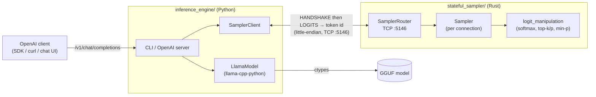
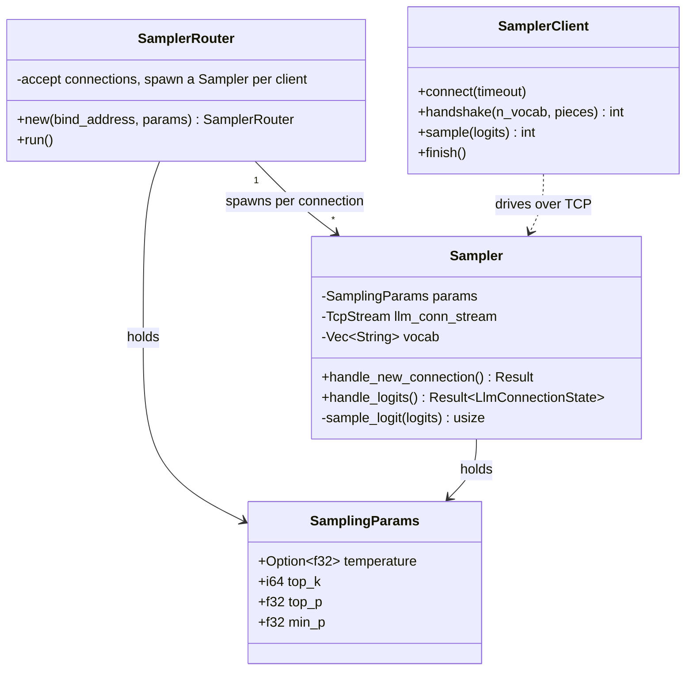

# stateful-logit-sampler

A two-part system that splits LLM **inference** from token **sampling** across a
TCP socket. The inference engine runs llama.cpp locally and produces logits each
decode step; a separate, stateful sampler process turns those logits into the
next token. Keeping sampling in its own process lets the sampling policy evolve
(and carry state across steps) independently of the model runtime.

This repository is a monorepo of two cooperating components:

| Directory | Language | Role | Docs |
|-----------|----------|------|------|
| [`inference_engine/`](inference_engine/) | Python | Loads a GGUF model with `llama-cpp-python`, runs the decode loop, streams raw logits to the sampler, and prints the chosen tokens. Also ships an OpenAI-compatible HTTP server. | [README](inference_engine/README.md) |
| [`stateful_sampler/`](stateful_sampler/) | Rust | TCP server that receives logits and returns a sampled token id (temperature / top-k / top-p / min-p). Listens on `:5146`. | [README](stateful_sampler/README.md) |

The two talk over a small little-endian wire protocol: a one-time **handshake**
(vocabulary exchange) followed by a **per-token** loop (`LOGITS` → token id).

## Architecture



## Component responsibilities



> The Rust sampler assumes **one** engine and **one** active chat completion at a
> time — there is no per-request context id, so concurrent chats / branched
> generations are not supported. See [`stateful_sampler/README.md`](stateful_sampler/README.md).

## Wire protocol

All integers and floats are **little-endian**.

| Phase     | Engine → Sampler                                                       | Sampler → Engine                       |
|-----------|------------------------------------------------------------------------|----------------------------------------|
| Handshake | `"HANDSHAKE"` + `i32(n_vocab)` + `(piece + \x00) × n_vocab` + `\x00`    | `i32(n_vocab)` (4 bytes)               |
| Per token | `"LOGITS"` + `n_vocab × f32`                                            | `i32(count)` + `i32(token)` (8 bytes)  |
| End       | socket close on end-of-generation                                      | (read == 0 ⇒ "Completed")              |

The authoritative description of each field (and the deliberate deviations from
the original Zig client) lives in
[`inference_engine/README.md`](inference_engine/README.md#wire-protocol).

## Quick start

The sampler must be running **before** the engine connects.

### 1. Start the Rust sampler

```bash
cd stateful_sampler
cargo run                      # listens on 0.0.0.0:5146 with default sampling params

# Override sampling parameters (defaults: temperature 1.0, top_k 1, top_p 1.0, min_p 0.05):
cargo run -- 0.0.0.0:5146 --temperature 0.8 --top_k 40 --top_p 0.95 --min_p 0.05

# Verbose logs (defaults to `info` when RUST_LOG is unset):
RUST_LOG=debug cargo run
```

### 2. Run the inference engine

```bash
cd inference_engine
uv sync                        # creates .venv, installs deps (incl. llama-cpp-python)

# One-shot CLI generation (delegates sampling to the sampler on :5146):
uv run python -m tcpip_gen <model.gguf> "The capital of France is" --n-predict 24

# Or expose an OpenAI-compatible HTTP API on :8000:
uv run python -m tcpip_gen.server \
    --model <model.gguf> \
    --host 127.0.0.1 --port 8000 \
    --sampler-host 127.0.0.1 --sampler-port 5146 \
    --max-tokens 256
```

Then call the server like any OpenAI endpoint:

```bash
curl -s localhost:8000/v1/chat/completions -H 'content-type: application/json' \
  -d '{"model":"m","messages":[{"role":"user","content":"The capital of France is"}],"max_tokens":24}'
```

> Sampling parameters sent by OpenAI clients (`temperature`, `top_p`, …) are
> **ignored**: the wire protocol only carries logits, so sampling is governed by
> the Rust sampler's own configuration. Set them via `cargo run -- …` flags.

## Development

Each component is built and tested independently.

```bash
# Rust sampler
cd stateful_sampler
cargo fmt
cargo build
cargo test

# Python inference engine
cd inference_engine
uv run ruff format .
uv run ruff check .
uv run pytest
```

Both subprojects have GitHub Actions CI
(`stateful_sampler/.github/workflows/rust.yml`,
`inference_engine/.github/workflows/ci.yml`).

## Repository layout

```
.
├── inference_engine/     # Python: llama.cpp runner + OpenAI-compatible server
│   ├── tcpip_gen/        #   protocol, client, generation, engine, server, CLI
│   └── tests/
├── stateful_sampler/     # Rust: TCP sampler server
│   └── src/
│       ├── main.rs       #   CLI args + SamplerRouter bootstrap
│       └── sampler/      #   Sampler + logit_manipulation
└── README.md             # (this file)
```
