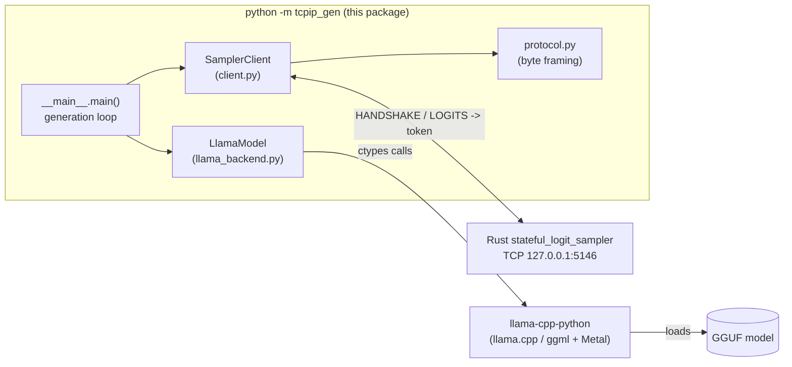
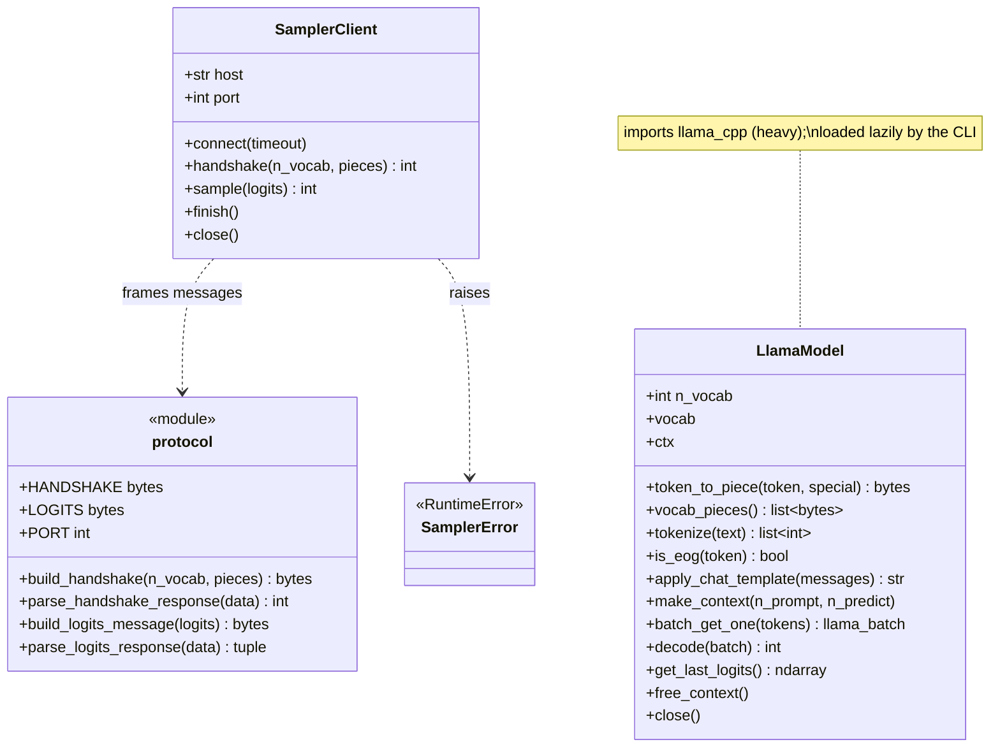
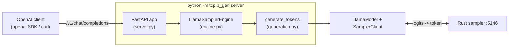

# stateful-sampler-inference

`tcpip_gen` runs llama.cpp inference **locally** but delegates token **sampling**
to a remote sampler over TCP. It loads a GGUF model with
[`llama-cpp-python`](https://github.com/abetlen/llama-cpp-python),
connects to the Rust
[`stateful_logit_sampler`](../stateful_sampler)
(listening on `127.0.0.1:5146`), streams raw logits each decode step, and prints
the tokens the sampler chooses.

An optional **OpenAI-compatible HTTP server** (`python -m tcpip_gen.server`)
fronts the same engine so standard clients (the `openai` SDK, `curl`, chat UIs)
can drive it — see [OpenAI-compatible server](#openai-compatible-server).

## Architecture



## Class diagram



## Wire protocol

All integers and floats are **little-endian**. This matches the running Rust
sampler (`sampler.rs`).

| Phase     | Client → Server                                                        | Server → Client            |
|-----------|------------------------------------------------------------------------|----------------------------|
| Handshake | `b"HANDSHAKE"` + `i32(n_vocab)` + `(piece + b"\x00") * n_vocab` + `b"\x00"` | `i32(n_vocab)` (4 bytes)   |
| Per token | `b"LOGITS"` + `n_vocab × f32`                                           | `i32(count)` + `i32(token)` (8 bytes) |
| End       | `b"\x00"` on EOG, then close socket                                     | (read == 0 ⇒ "Completed")  |

## Setup

Requires [`uv`](https://docs.astral.sh/uv/) and Python ≥ 3.11.12.

```sh
uv sync                 # creates .venv and installs deps (incl. llama-cpp-python)
source .venv/bin/activate   # optional; or prefix commands with `uv run`
```

Or run the whole stack (sampler + server + Open WebUI) with Docker Compose from
the repo root — see the [top-level README](../README.md):

```sh
docker compose up --build   # MODEL_FILE=<name>.gguf picks one of several models
```

## CLI usage

Start the sampler first (must be listening on `127.0.0.1:5146`), then:

```sh
# Generate up to 256 tokens, delegating sampling to the remote sampler.
uv run python -m tcpip_gen <model.gguf> "<prompt>"

# Options: point at a different sampler, cap the token count.
uv run python -m tcpip_gen <model.gguf> "<prompt>" \
    --host 127.0.0.1 --port 5146 --n-predict 64
```

Example (the model used to verify this package lives outside the repo):

```sh
uv run python -m tcpip_gen \
    /Users/michael/Project/workspace/printers-company-inc/models/Meta-Llama-3.1-8B-Instruct.IQ3_M.gguf \
    "The capital of France is" --n-predict 24
# -> The capital of France is a city of love, art, fashion, and food. ...
```

Generated text streams to **stdout**; llama.cpp/diagnostic logs go to **stderr**.

`python main.py <model.gguf> "<prompt>"` is a thin shim for the same CLI.

## OpenAI-compatible server

`python -m tcpip_gen.server` puts an OpenAI-compatible HTTP API in front of the
same engine, so the official `openai` SDK, `curl`, or any compatible chat UI can
drive generation. Token sampling is still performed by the remote Rust sampler.



### Endpoints

- `GET /v1/models` → `{"object":"list","data":[{"id":<model>,"object":"model",...}]}`
- `POST /v1/chat/completions` → an OpenAI `chat.completion`, or — with
  `"stream": true` — a `text/event-stream` of `chat.completion.chunk` events
  (first chunk carries `delta.role`, then `delta.content` deltas, a final chunk
  with `finish_reason`, then a literal `data: [DONE]`).

Any `Authorization: Bearer <key>` header is accepted and ignored.

### Launch

```sh
uv run python -m tcpip_gen.server \
    --model <model.gguf> \
    --host 127.0.0.1 --port 8000 \
    --sampler-host 127.0.0.1 --sampler-port 5146 \
    --max-tokens 256
```

`--model` also accepts a directory that holds exactly one `.gguf` (this is
what Docker Compose passes when `MODEL_FILE` is unset).

### Use it

```sh
curl -s localhost:8000/v1/chat/completions -H 'content-type: application/json' \
  -d '{"model":"m","messages":[{"role":"user","content":"The capital of France is"}],"max_tokens":24}'
```

```python
from openai import OpenAI

client = OpenAI(base_url="http://127.0.0.1:8000/v1", api_key="sk-ignored")
r = client.chat.completions.create(
    model="m",
    messages=[{"role": "user", "content": "The capital of Japan is"}],
    max_tokens=16,
)
print(r.choices[0].message.content)  # -> "The capital of Japan is Tokyo."
```

### Sampling parameters are ignored

`temperature`, `top_p`, `top_k`, `seed`, and the penalties are **accepted but
ignored**: the wire protocol only carries logits, so sampling is governed by the
remote sampler's own configuration. `max_tokens` / `max_completion_tokens`,
`stop`, and `stream` *are* honored locally. The server keeps **one** sampler
connection (handshake once at startup) and serializes generations with a lock;
it never sends the inter-request `finish()` null byte, which would desync the
sampler's fixed-length framing.

## Testing

```sh
uv run ruff format .     # format
uv run ruff check .      # lint
uv run pytest            # unit tests
```

- `tests/test_protocol.py` — exact byte layouts of every framing helper (pure).
- `tests/test_client.py` — `SamplerClient` against an in-process fake sampler
  (`tests/fake_sampler.py`), including the protocol error paths.
- `tests/test_generation.py` — the shared `generate_tokens` loop (EOG stop,
  `max_tokens` cap, no stray `finish()` byte) with fake model/client.
- `tests/test_engine.py` — UTF-8-safe streaming and stop-string handling.
- `tests/test_server.py` — the HTTP contract (`/v1/models`, streaming and
  non-streaming chat completions, param passthrough) via FastAPI `TestClient`
  and a fake engine.
- `tests/test_integration_handshake.py` — real handshake against the sampler on
  `:5146`; **auto-skipped** when nothing is listening.

All tests run without `llama_cpp` (the model wrapper is type-only at import
time), so they run in CI. `LlamaModel` is exercised by the end-to-end runs above.

## Layout

```
tcpip_gen/
  protocol.py       # pure byte framing (no sockets, no llama_cpp)
  client.py         # SamplerClient: TCP driver for the protocol
  generation.py     # generate_tokens: shared decode -> sample -> token loop
  llama_backend.py  # LlamaModel: low-level llama_cpp wrapper (lazy import)
  engine.py         # Engine protocol + LlamaSamplerEngine (chat + streaming)
  server.py         # FastAPI OpenAI-compatible app + `python -m tcpip_gen.server`
  __main__.py       # CLI (`python -m tcpip_gen`)
tests/              # protocol, client, generation, engine, server, handshake
```
