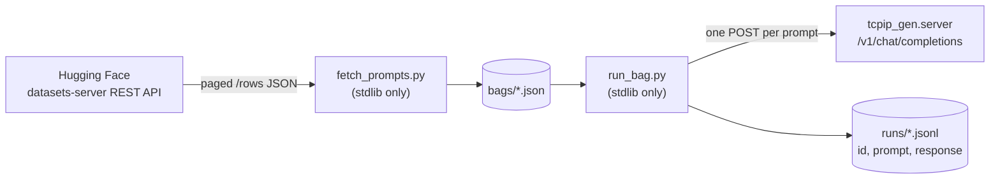
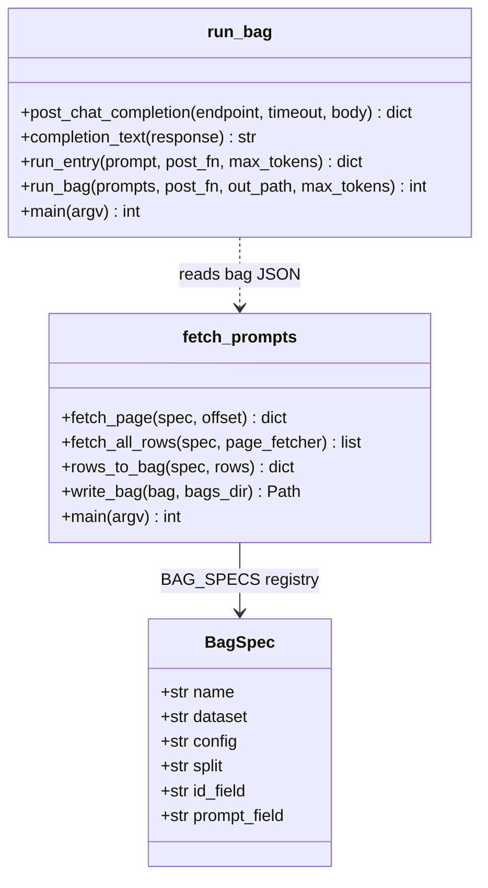

# prompt_eval

Prompt "bags" for exercising the OpenAI-compatible `/v1/chat/completions`
server. A bag is a JSON file with a list of prompts from one benchmark dataset.
`run_bag.py` feeds each prompt to the endpoint and stores the responses in one
JSONL file per run.

## How to run

The server must be up first (see the [root README](../README.md) quick start).

```bash
cd prompt_eval

# 1. Download all bags (writes ./bags/<name>.json):
uv run python fetch_prompts.py

# Or download one bag / write elsewhere:
uv run python fetch_prompts.py humaneval_python
uv run python fetch_prompts.py --out-dir /tmp/bags

# 2. Run a bag against the endpoint (writes ./runs/<bag>-<timestamp>.jsonl):
uv run python run_bag.py bags/mbpp_python.json

# Useful runner flags:
uv run python run_bag.py bags/humaneval_python.json \
    --endpoint http://127.0.0.1:8000/v1/chat/completions \
    --max-tokens 256 \
    --limit 5 \
    --timeout 600 \
    --out runs/smoke.jsonl
```

No API key or `datasets` package is needed — prompts come from the public
[Hugging Face datasets-server](https://huggingface.co/docs/datasets-server)
REST API, and both scripts use the standard library only.

## How to test

```bash
cd prompt_eval
uv run pytest          # unit tests; no network, no model, no sampler needed
uv run ruff format .
```

## Available bags

| Bag | Dataset | Split | Prompts | Content |
|-----|---------|-------|---------|---------|
| `humaneval_python` | [openai/openai_humaneval](https://huggingface.co/datasets/openai/openai_humaneval) | test | 164 | Python function signatures + docstrings to complete |
| `mbpp_python` | [google-research-datasets/mbpp](https://huggingface.co/datasets/google-research-datasets/mbpp) (sanitized) | test | 257 | Natural-language Python programming tasks |

## Bag format

```json
{
  "name": "mbpp_python",
  "source": {
    "dataset": "google-research-datasets/mbpp",
    "config": "sanitized",
    "split": "test"
  },
  "prompts": [
    {"id": "11", "prompt": "Write a python function to ..."}
  ]
}
```

Prompts are stored verbatim from the dataset. Any chat-instruction wrapping
(system prompts, "complete this function" framing) is the runner's job, so one
bag can serve multiple experiment setups.

## Run format

One JSONL file per run, default `runs/<bag>-<timestamp>.jsonl`, one line per
request:

```json
{"id": "<uuid4>", "prompt": "Write a python function to ...", "response": "def ..."}
```

- `id` is a fresh UUID generated for each request.
- The prompt is sent as a single `user` message; the response is the assistant
  text from `choices[0].message.content`.
- If a request fails, the line has `"response": null` and an `"error"` key,
  and the run continues with the next prompt.
- Lines are flushed as they complete, so an interrupted run keeps its
  finished prompts.
- Requests run sequentially — the server serializes generations anyway (one
  llama context, one sampler connection).
- `runs/` is gitignored; commit a run file deliberately if you want to keep it.

## Architecture





## Adding a new bag

Add one `BagSpec` entry to `BAG_SPECS` in `fetch_prompts.py` (dataset, config,
split, and the row fields to use as `id` and `prompt`), then run
`uv run python fetch_prompts.py <name>`.
