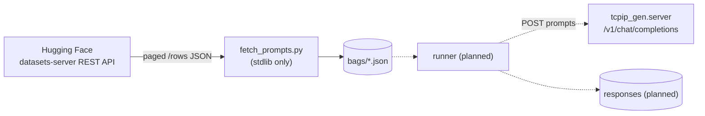
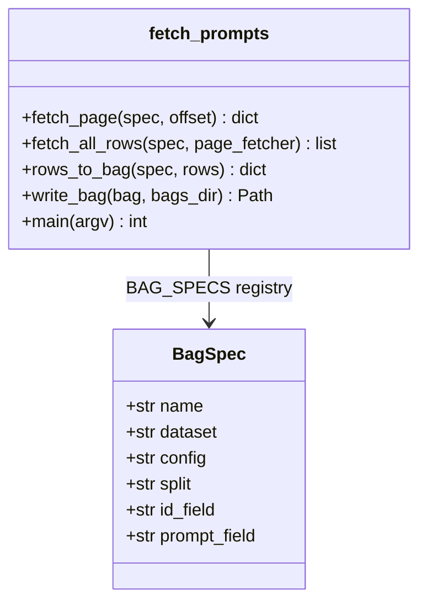

# prompt_eval

Prompt "bags" for exercising the OpenAI-compatible `/v1/chat/completions`
server. A bag is a JSON file with a list of prompts from one benchmark dataset.
A later runner will feed each prompt to the endpoint and store the response.

## How to run

```bash
cd prompt_eval

# Download all bags (writes ./bags/<name>.json):
uv run python fetch_prompts.py

# Download one bag:
uv run python fetch_prompts.py humaneval_python

# Write to a different directory:
uv run python fetch_prompts.py --out-dir /tmp/bags
```

No API key or `datasets` package is needed — prompts come from the public
[Hugging Face datasets-server](https://huggingface.co/docs/datasets-server)
REST API with the standard library only.

## How to test

```bash
cd prompt_eval
uv run pytest          # unit tests, no network
uv run ruff format .
```

## Available bags

| Bag | Dataset | Split | Prompts | Content |
|-----|---------|-------|---------|---------|
| `humaneval_python` | [openai/openai_humaneval](https://huggingface.co/datasets/openai/openai_humaneval) | test | 164 | Python function signatures + docstrings to complete |
| `mbpp_python` | [google-research-datasets/mbpp](https://huggingface.co/datasets/google-research-datasets/mbpp) (sanitized) | test | 257 | Natural-language Python programming tasks |

## Bag format

```json
{
  "name": "mbpp_python",
  "source": {
    "dataset": "google-research-datasets/mbpp",
    "config": "sanitized",
    "split": "test"
  },
  "prompts": [
    {"id": "11", "prompt": "Write a python function to ..."}
  ]
}
```

Prompts are stored verbatim from the dataset. Any chat-instruction wrapping
(system prompts, "complete this function" framing) is the runner's job, so one
bag can serve multiple experiment setups.

## Architecture





## Adding a new bag

Add one `BagSpec` entry to `BAG_SPECS` in `fetch_prompts.py` (dataset, config,
split, and the row fields to use as `id` and `prompt`), then run
`uv run python fetch_prompts.py <name>`.
