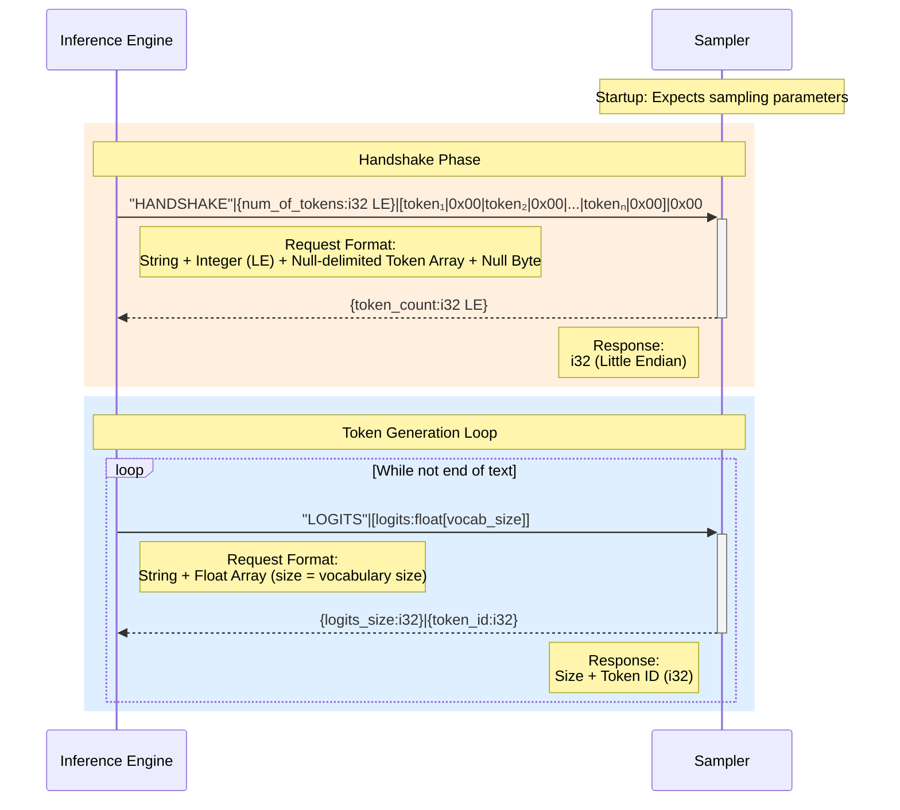

## What is this?

This is a rust implementation of a sampler to be plugged into inference engine via TCP socket.



## This design assumes the following:
### Only one instance of engine and one instance of chat completion is running
Multiple instances of chat and multiple branches of a chat generated via TTC are not supported. They would require a way to identify the context of the request.

#### How to build
```bash
cargo build 
```

#### How to test
```bash
cargo test 
```

#### How to run
```bash
cargo run 
```

#### How to run in Docker
```bash
docker build -t stateful-sampler .
docker run -p 5146:5146 stateful-sampler
# or, from the repo root, as part of the full stack:
docker compose up sampler
```

#### Logging
Log verbosity is controlled by the `RUST_LOG` environment variable (parsed by
`tracing-subscriber`'s `EnvFilter`). When `RUST_LOG` is unset, the level defaults
to `info`, so `debug!` events are hidden.

```bash
# Show debug! (and higher) logs
RUST_LOG=debug cargo run

# Only this crate at debug, everything else at info
RUST_LOG=stateful_sampler=debug cargo run

# Default (info and above) — debug! is suppressed
cargo run
```

At `debug` level the sampler also resolves each sampled token index back to its
vocabulary string (via `Sampler::debug_token_from_index`) and logs the result,
e.g. `Sampled index 42 maps to token: "hello"`. This is handy for confirming
which token a chosen index corresponds to without cross-referencing the vocab by
hand.

#### How to rebuild + run upon changes
```bash
cargo watch -c -x run
```


## TODO:

Phase 0:
- [ ] Update mistral.rs to use socket sampler adapter
- [ ] Create a sampler run independently that listens for the socket connection
- [ ] Implement the default sampler logic

Phase 1
- [ ] Implement sampler which tunes the logit output
